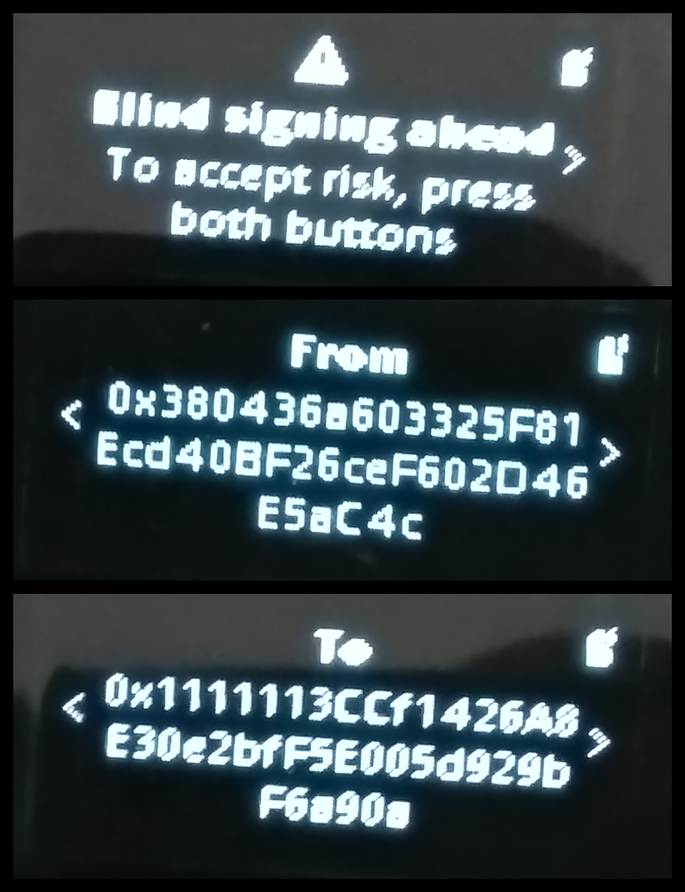

# Developer Experience feedback — Ledger Agent Stack, from Freeboard Finance

Freeboard (ETHOnline 2026) AI Agents x Ledger track used the Ledger stack two ways:

- **Human in the loop.** The borrower approves a risk policy — an HF→weights curve — by signing
  an `Aqua.ship()` transaction whose calldata *is* the policy, on a physical Ledger, through the
  official `@ledgerhq/wallet-cli` 2.1.0 (`send --data`). It landed on Ethereum mainnet:
  [`0xc13c55e1…70c4`](https://etherscan.io/tx/0xc13c55e18bc748b5f85ec680fa14d759b30682b7296bf7ba84c2bf43d91f70c4).
- **Agent with secrets it cannot leak.** An LLM keeper-taker (Strands Agents + Claude) whose RPC
  URL, signing key and its own API key live under the Ledger Key Ring (`ring encrypt/decrypt`),
  decrypted into memory at start-up, never on disk or in the environment.

Everything below is what we hit doing that, in the order a new integrator would hit it, with
the file and line we ended up reading when the docs ran out. Where we quote a path it is in
`LedgerHQ/ledger-live`, `apps/wallet-cli`, branch `develop`, on Sep 9 2026.

## Summary

The workshop said "a simple page would do." This is that page; each line links to its evidence
below.

1. [**Overall experience**](#1-feedback-on-overall-experience-using-ledger-docs--sdks) — the
   wallet-cli agent skill is the best thing you ship; the gap is between the portal and the
   source, and it cost a day.
2. [**Gaps**](#2-identify-gaps-confusing-flows-or-missing-context) — thirteen, each with the
   file and line where the answer was: `send --data` (stuck in a skill sync), no sign-only mode
   and explorer-only Ethereum, the single USB transport, `ring` stdin/stdout, a flag the skill
   forbids, the missing amount line on a zero-value call, no ERC-7730 test path, the Node 12
   crash, `account discover` semantics, an undefined "Agent Stack", no `repository` field, Nano X
   and the Key Ring, Transaction Check on a Nano.
3. [**Six PRs**](#3-specific-improvements-with-screenshots-or-prs) — all against
   `LedgerHQ/ledger-live`, because the skill in `agent-skills` is a generated mirror and the
   portal's source is private: the `send --data` rule and its consequences; the USB-only
   transport; `ring` semantics; what the device shows for a blind-signed call; the launcher's
   `node:` prefix — a one-line fix, not a version guard, proven under Node 12; and
   `repository`/`homepage`/`bugs` in the published package.
4. [**Tutorial ideas**](#4-better-tutorial-or-code-sample-ideas) — sign a contract call from the
   CLI; a Key Ring for an agent's secrets, contrasting workshop's decrypt-at-call-time with our
   decrypt-before-the-model; what the human is approving, three ways; human-in-the-loop for an
   agent, honestly.
5. [**Portal navigation**](#5-navigation-or-search-improvements-for-the-portal) — one "what can
   wallet-cli sign?" table, a Speculos search that lands on the right page, index the CLI's
   `--help`, cross-link skill ↔ portal ↔ source.
6. [**Time-savers**](#6-time-saver-suggestions-for-future-integrators) — fourteen, in the order
   they would have saved us the most time; the first is "read `send.ts` before designing."

Three first-hand findings the workshop could not give, for the judges in a hurry: a **Nano X**
provisions and uses the Key Ring (asked in the Q&A, unanswered); a **zero-value contract call
shows no amount line** on the device; **Transaction Check does not run on a Nano X**, so a
blind-signed call there has no simulation step at all. And one design difference stated plainly:
the workshop's human-in-the-loop approves *actions* past a threshold; Freeboard's human approves
a *policy* once, on the device, and the chain enforces it — the threshold is the per-fill cap,
and the only way past it is a new signature on the device.

---

## 1. Feedback on overall experience using Ledger docs & SDKs

**The good, first, because it is real.** The Ledger `wallet-cli` skill for coding agents
(`npx skills add ledgerhq/agent-skills`, `.claude/skills/wallet-cli/wallet-cli-usage/SKILL.md`)
is the best piece of developer documentation we used for the Ledger stack. It is written
for the reader who will actually run the commands: which commands touch the device, which need
the sandbox bypass, that two device commands must never run in parallel, the exact keychain
pattern for `WALLET_PASS` so a password never lands in a transcript, the rule that decrypted
output is never printed. We adopted every one of those rules, and two of them caught mistakes in
our own plan before they became mistakes on a device. Ship more of this.

The CLI itself is solid. Every command we ran did what its `--help` said, `--dry-run` needs no
device and validates a real transaction against the real backend, `genuine-check` and `receive`
put the trusted display where it belongs, and `ring init` → `ring encrypt` → `ring decrypt`
worked first time. The DMK skills are thorough on concepts (Clear Signing vs Blind Signing,
Secure Channel, the `0x6a80` "Blind signing not enabled" mapping).

**The gap is between the portal and the source.** The portal page for the CLI
(`/docs/ai-tools/ledger-cli`) lists commands and device requirements but not what they can
*sign*, and the npm package is a prebuilt binary with no `repository` field, so the only way to
answer "can this sign arbitrary calldata?" or "can `ring init` run on Speculos?" was to find the
monorepo by reading `README.md`'s relative links (`../../docs/repo-commands.md`, `apps/cli`) and
then read `src/`. We spent most of a day there. The answers were all yes/no in the code and
absent from the docs — see the next section. A developer who does not read source would have
planned around the wrong assumptions.

---

## 2. Identify gaps, confusing flows, or missing context

Each of these cost us time; each is a sentence or a paragraph to fix.

1. **`send --data` was undocumented where it matters — and the fix is stuck in a sync.** It
   exists — `src/commands/send.ts:134-145`, `--data  EVM calldata as 0x-prefixed hex (e.g.
   0xd0e30db0)`, added in ledger-live PR #16435 — and it is the whole reason the CLI could sign
   our `ship()`. On Sep 9–10 it was in neither the portal's CLI page nor the installed skill
   (`SKILL.md:156-169` lists Bitcoin and Solana flags only); we found it in `CHANGELOG.md`.
   Checking again on Sep 12: ledger-live's canonical skill (`.agents/skills/ledger-wallet-cli/SKILL.md`,
   commit `6faa077`) now has an **EVM flags** paragraph and a WETH wrap/unwrap example with a
   `--amount '0 ETH'` call — but the copy developers install from `LedgerHQ/agent-skills` is a
   generated mirror, and the bot's sync PR carrying it (agent-skills #26, opened Sep 8) is
   still open. So the documentation exists and nobody who ran `npx skills add` this week got it.
   Two things remain absent everywhere: that a zero-value call is allowed *as a rule*
   (`@ledgerhq/coin-evm` `logic/validateIntent.js:34-40`: `AmountRequired` only when there is no
   calldata — the example shows it, nothing states it), and item 2 below.

2. **There is no sign-only mode, and Ethereum goes through Ledger's explorer, not an RPC.**
   `src/wallet/sign-and-broadcast.ts` signs then `bridge.broadcast`; `families/evm/config.ts`
   `config_currency_ethereum` has `node/explorer/gasTracker: { type: "ledger" }`, overridable only
   by the undocumented `EXPLORER` env. Consequence: a device-signed transaction cannot be pointed
   at a fork, a testnet-like local node, or a custom RPC. That decided our architecture (the ship
   went to real mainnet; the fills stayed on a fork). Nothing in the docs says it. One sentence
   under `send` — "signs and broadcasts through Ledger's backend; no sign-only output; always the
   account's real network, never a fork or a local node" — would have saved the spike.

3. **The Speculos / Key Ring question was asked on Discord.** The
   answer is in one line: `src/device/register-dmk-transport.ts:28`
   `MODULE_ID = "wallet-cli-dmk-webusb"` — wallet-cli has exactly one transport, USB. `ring init`
   therefore needs a physical device. Speculos is a DMK transport (`@ledgerhq/device-transport-kit-speculos`),
   not a wallet-cli one. Say so on the portal, next to the "Ledger device connected over USB"
   prerequisite, and in the hackathon FAQ.

4. **`ring` text mode is documented by example only.** The portal says "files via -i/-o"; the
   skill shows `pbpaste | wallet-cli ring encrypt … | pbcopy`. That `--input`/`--out` *default to
   stdin/stdout* is only in `--help`, and that `ring decrypt` writes raw plaintext bytes to
   stdout (`src/commands/ring/shared.ts:75`) while `--output json` to stdout is refused is only in
   source. For an agent that must parse the plaintext in memory, those two facts are the whole
   integration.

5. **The CLI's `--unsecure-no-password` contradicts the skill's "always provision with a
   password".** Both are Ledger's. The flag exists in `ring init --help`; the skill (`:259`) says
   never. We followed the skill, but a reader of only the CLI would not know the rule exists.
   Either document the flag as dev/CI-only on the portal, or hide it behind an env.

6. **A 0-ETH contract call shows no amount on the device.** When the borrower signed, the
   Ethereum app showed the contract address and the blind-signing data hash — no "Amount 0 ETH"
   line — and the first question was "why don't I see the amount?" (the CLI printed
   `Amount: 0 ETH` on the host side). Document what the device screen shows for a blind-signed
   contract call, field by field, so the human knows what to verify: the `to` address and the
   absence of value.

7. **Clear signing for a hackathon-time contract has no documented path.** The DMK skill explains
   ERC-7730 well; the portal's clear-signing page explains *what* a descriptor is. Neither says
   how a team tests a descriptor against a real device *before* it is merged into the registry
   (the signer flips to CAL `test` mode when `CAL_SERVICE_URL` contains `ledger-test` —
   `libs/live-signer-evm/src/DmkSignerEth.ts` — but that is source, not docs), or what the
   publication lead time is. We had to leave "four readable rows on the device" as stretch and
   write "blind-signed contract call" in our limitations instead.

8. **The failure message when `node` is too old is opaque.** The npm `bin/wallet-cli` is a Node
   script with a `node` shebang. On a shell where `node` resolved to a system Node 12, it died
   with `Cannot find module 'node:child_process'`. An `engines` check or a one-line preamble —
   "wallet-cli needs Node ≥ 22; found v12.22.9" — would turn a ten-minute detour into zero.

9. **`account discover` and unused accounts.** It listed our used accounts plus the next empty
   one — Ledger Live's convention — and that turned out to be exactly right, but we could not
   find it written anywhere and had a fallback ready in case it only listed accounts with
   history. One sentence on the portal.

10. **"Ledger Agent Stack" is a term the hackathon brief uses and the overview page does not
    define.** `/docs/ai-tools/overview` describes the CLI and the DMK skills; the brief says
    entries "must be built on the Ledger Agent Stack, and in particular the Ledger Key Ring CLI".
    A short definition — these packages, these repos, this is what counts — on the overview page
    would remove the guessing.

11. **The npm package has no `repository` field and no link to its source.** `npm view
    @ledgerhq/wallet-cli repository` returns nothing. The source is
    `LedgerHQ/ledger-live/apps/wallet-cli`. Add the field; every gap above was closed by reading
    that directory.

12. **Nano X and the Key Ring — asked in the workshop Q&A.** First-hand: a
    Nano X with the Ledger Sync app installed provisions the Key Ring (`ring init`), and
    `encrypt`/`decrypt`/`keys` then work with the device unplugged. One line on the portal's CLI
    page ("Key Ring: any device that runs the Ledger Sync app, including Nano X") would have
    settled a question three hackathon teams asked.

13. **Transaction Check is touchscreen-only, and the docs do not say what that means for a
    Nano.** The workshop presented Transaction Check (Ledger's pre-signing simulation, launched
    May 2025 with third-party providers) as the fraud safeguard, and noted it runs on the
    touchscreen devices. On a Nano X a blind-signed contract call therefore has *no* simulation
    step: the signer sees the address and a hash, and the address is the only thing to verify.
    The CLI page and the skill should say which safeguards apply to which device family, so a
    Nano user knows the address check is the whole check.

---

## 3. Specific improvements with screenshots or PRs

The concrete artifacts are the diffs below, each a PR we are opening. One thing to know about
where they go: the wallet-cli skill in `LedgerHQ/agent-skills` is a **generated mirror** —
`.github/workflows/sync-wallet-cli-skill.yml` in ledger-live exports
`.agents/skills/ledger-wallet-cli/` through `apps/wallet-cli/scripts/export-standalone-skill.mjs`
(rewriting `pnpm --silent wallet-cli start` to `wallet-cli`) and opens a bot PR. A PR against
agent-skills would be overwritten by the next sync, so PRs 1, 3 and 4 target the canonical file
in ledger-live. The portal's source (`LedgerHQ/developer-portal`) is private and the pages have
no edit link, so PR 2 and the portal half of PR 4 are text proposals sent through this document. 
The one screenshot that matters — the Nano X screen during the blind-signed `ship()` — is the signer's own recording, attached to PR 4.

**PR 1 — ledger-live, `.agents/skills/ledger-wallet-cli/SKILL.md`, `send` section.** The
`--data` flag and a zero-value example are already there on `develop` (see gap 1). What is
missing is the rule and the consequence, appended after the `#### Contract calls with --data`
example. Opened Sep 13 as issue
[#21908](https://github.com/LedgerHQ/ledger-live/issues/21908) and PR
[#21909](https://github.com/LedgerHQ/ledger-live/pull/21909); two rounds of Copilot review,
each citing source (`--data 0x` is a plain transfer, not a contract call; `send` on testnets is
out of the skill's scope, so no Sepolia example; no `dmk` skill exists in ledger-live, so the DMK
docs are linked), ended in "Approval recommended". The text as it stands in the PR:

```markdown
A zero-value call is allowed whenever `--data` carries non-empty calldata (`--amount '0 ETH'`).
An empty `--data 0x` does not make the transaction a contract call: with a non-zero amount it is a
plain transfer; with a zero amount it is rejected with `AmountRequired`. The account can be
positional or `--account`.

`send` signs **and** broadcasts through Ledger's backend. There is no sign-only output and no
custom RPC: the transaction goes to the account's real network. For a fork or a local node, use the
[Device Management Kit](https://developers.ledger.com/docs/device-interaction/integration/how_to/dmk)
directly.
```

**PR 2 — portal CLI page, prerequisites:**

```markdown
wallet-cli talks to one transport: USB (DMK over node WebUSB). Speculos is a DMK transport
for your own code, not a wallet-cli option; `ring init`, `account discover`, `send`, `receive`
and `genuine-check` need a physical device. `ring encrypt/decrypt` need no device after `init`.
```

**PR 3 — ledger-live, `.agents/skills/ledger-wallet-cli/SKILL.md`, `ring` section**, between the
command block and the "Always provision with a password" callout (the mirror's line 257). Opened
Sep 13 as issue [#21910](https://github.com/LedgerHQ/ledger-live/issues/21910) and PR
[#21911](https://github.com/LedgerHQ/ledger-live/pull/21911); one Copilot round (the `--out` write
is atomic on POSIX only — `writeSecureFile`'s Windows fallback is delete-then-rename), then
"Approval recommended". The text as it stands in the PR:

```markdown
`--input`/`--out` default to stdin/stdout, so `ring decrypt --key K < secrets.ring` writes the raw
plaintext bytes to stdout and nothing else; spinners and the password prompt go to stderr, so stdout
can be piped or captured as-is. With no `--input` and a TTY on stdin the command refuses
(`No input: provide --input FILE or pipe data to stdin.`). `--output json` is refused unless `--out
<file>` is given — binary data cannot be written as JSON to stdout. A file written with `--out` is
created at 0600 and renamed into place: atomic on POSIX, best-effort (delete then rename) on Windows.
`ring init --unsecure-no-password` exists and stores the private key unencrypted
in the OS keychain; the rule below applies — never use it for a ring that will hold a real secret.
```

**PR 4 — the device screen for a `--data` call.** Two halves. (a) ledger-live's canonical skill
currently ends the `--data` section with "review the decoded call on-device before approving".
That holds for the section's own WETH example — WETH has a descriptor in the ERC-7730
clear-signing registry — and for nothing else: a contract without a descriptor is *blind-signed*
and nothing is decoded. Opened Sep 13 as issue
[#21912](https://github.com/LedgerHQ/ledger-live/issues/21912) and PR
[#21913](https://github.com/LedgerHQ/ledger-live/pull/21913), stacked on #21909 because it edits
the sentence those paragraphs sit under; Copilot recommended approval on the first pass. The
sentence is split into the two cases, and the blind-signed one says what the Nano X actually
shows, screen by screen: "Blind signing ahead", To, From, Max fees, a two-screen Transaction
Hash, then Accept and send / Reject — no decoded fields and, for a zero-value call, **no Amount
screen** (the host prints `Amount: 0 ETH`; the device does not); verify the To address, reject
anything else; Blind signing is app-wide — enable it for the call, disable it after; a button
Nano has no Transaction Check, so the address check is the whole check. (b) The portal: the same
paragraph plus one photo per device family. Our photo — the Nano X Ethereum app reviewing this
exact call: the warning, From and To — is attached to the PR:




**PR 5 — ledger-live, `apps/wallet-cli/bin/wallet-cli`: not a version guard, a one-line fix.**
The launcher's only Node-specific line is `require("node:child_process")`; the binary it spawns
is Bun-compiled and needs no Node at all. Dropping the `node:` prefix makes the launcher run on
any Node that has `spawnSync` — verified under Node 12.22.9 against the published 2.1.0: the
unpatched launcher throws `Cannot find module 'node:child_process'`, the patched copy prints
`--version`. A guard would have turned a crash into a message; the fix removes the reason for
either.

**PR 6 — ledger-live, `apps/wallet-cli/scripts/prepare-npm.mjs`.** The published `package.json`
is not the source one: `prepareMainPackage()` builds it from a whitelist (name, version,
description, license, bin, files, optionalDependencies, publishConfig), so adding `repository` to
`apps/wallet-cli/package.json` would never reach npm. The fix adds `repository`, `homepage` and
`bugs` to that whitelist — and to the four platform packages — in the form every other published
package in the monorepo uses (`@ledgerhq/hw-transport`, `@ledgerhq/ledger-key-ring-protocol`):
`repository: { type: "git", url: "https://github.com/LedgerHQ/ledger-live.git" }`,
`homepage: "https://github.com/LedgerHQ/ledger-live/tree/develop/apps/wallet-cli"`,
`bugs: { url: "https://github.com/LedgerHQ/ledger-live/issues" }`.

The commands we actually ran, in order, are in this repo's `agent/README.md` and
`results/ledger-ship.txt`; the plan we followed and revised after the spike is
`docs/ledger-spike.md`, which is the raw form of this document.

---

## 4. Better tutorial or code sample ideas

1. **"Sign a contract call on a Ledger from the CLI."** Build calldata with `cast calldata` (or
   `abi.encodeCall` in a forge script), `send … --amount '0 ETH' --data`, dry run, enable blind
   signing, sign, read the receipt. It is the most general thing the CLI can do and
   the only tutorial covers native transfers.

2. **"A Key Ring for your agent's secrets."** `keeper.env` with three lines → `ring init` (with
   the keychain `WALLET_PASS` pattern) → `ring encrypt … < keeper.env > keeper.env.ring` →
   `rm keeper.env` → the agent runs `ring decrypt` at start-up and parses stdout in memory, never
   writing or exporting the values. Then the one line that matters for Ledger's own brief: pass
   the LLM API key to the SDK *as a constructor option*, not through the environment. This is
   the tutorial the hackathon brief is asking for, and it does not exist yet. Our `agent/keeper.ts`
   is a working sample of it (`loadSecrets`, ~30 lines). Workshop demo (09:49–13:27) is
   the same idea with one difference worth teaching explicitly: there, the agent runs `ring
   decrypt` itself at call time, so the key stays out of the model's *context* but the model
   holds the decrypt *capability*; here, a wrapper decrypts before the model exists and passes the
   key to the SDK as an option, so the model has neither. Both are valid; the tutorial should show
   both and say which threat each one closes (a leaked transcript vs. a prompt-injected "decrypt
   and print").

3. **"What the human is approving."** A tutorial that shows the same contract call three ways on
   the device — blind-signed, clear-signed with an ERC-7730 descriptor in CAL test mode, and
   clear-signed after publication — with the exact steps between them. Teams would then know on
   day one whether readable rows are achievable inside a hackathon week.

4. **"Human-in-the-loop for an agent, honestly."** A pattern doc: the device approves a *policy*
   (a transaction whose calldata commits the rule), the agent operates inside it, and the
   *contract* enforces the bound — not the agent's prompt. Freeboard Finance is one instance (a
   per-fill cap the router refuses by name); the pattern is general and the brief's fourth
   bullet describes it without an example.

---

## 5. Navigation or search improvements for the portal

- **One "What can wallet-cli sign?" table**, linked from the CLI page and the hackathon page:
  rows for native transfer, ERC-20, arbitrary calldata, EIP-712 typed data, personal_sign;
  columns for wallet-cli, DMK signer, Ledger Live. Today the answer (transactions yes, calldata
  yes but undocumented, typed data only via the DMK signer) is spread across the CHANGELOG,
  `live-signer-evm`, and Discord.
- **Search for "Speculos" should land on a page that says which tools support it.** It currently
  lands on the device-app framework page, which is about emulating a *device app*, and that was
  the link given on Discord in reply to a question about the Key Ring.
- **Search for `--data`, `calldata`, `ring decrypt stdout`** returned nothing relevant; all three
  are in `--help`. Indexing the CLI's `--help` text (it is JSON, machine-readable) would fix a
  whole class of misses at once.
- **Cross-link the skill and the portal page.** They describe the same commands with different
  emphasis; a reader who finds one does not know the other exists. The skill is the better
  document — link *to* it from the portal, not only the other way.
- **Link the source from the portal CLI page** (`LedgerHQ/ledger-live/apps/wallet-cli`). For a
  tool this new, "read the source" is the honest fallback, and the page should make it a
  one-click one.

---

## 6. "Time-saver" suggestions for future integrators

Things we know now that we wish we had known on day one, in the order they would have saved
the most time:

1. **Read `apps/wallet-cli/src/commands/send.ts` and `sign-and-broadcast.ts` before designing.**
   Twenty minutes there answers: calldata yes, zero value yes, sign-only no, custom RPC no,
   always the account's real network, never a fork. Everything downstream depends on those five
   answers.
2. **`ring` does not sign. It encrypts.** Plan the human approval around `send` and the agent's
   secrets around `ring`; they are two unrelated tools in one binary.
3. **Physical device or nothing for wallet-cli.** Do not spend a day on Speculos for the Key Ring.
4. **Put the ring password in the OS keychain on day one** and only ever reference it as
   `WALLET_PASS=$(security find-generic-password -a default -s ledger-wallet-cli -w)`. Once a
   password has been typed at a prompt it is in shell history; once it is in a coding agent's
   command it is in the transcript.
5. **Run `wallet-cli send --help` first**, whatever the docs say — the `--help` output is the
   only complete reference and it is JSON.
6. **`--dry-run` is free and needs no device.** Use it to prove the account syncs and the call
   validates before touching blind-signing settings.
7. **Fund the account you will sign with before `account discover`** if you want it to be
   discoverable with certainty; then `receive <label>` and compare on the device before sending
   anything to it. Never fund an address you have not seen on the device screen.
8. **Expect no amount line on the device for a 0-ETH contract call.** Verify the `to`.
9. **Enable blind signing for the one transaction, then disable it.** It is an app setting, not
   a per-transaction one.
10. **Pin your Node.** `wallet-cli` is a Node script; a stale `node` on `PATH` fails with a
    module error, not a version message.
11. **Use a fresh account index on the same seed for anything public.** The signed transaction
    is permanent evidence with your address on it; a dedicated account keeps it clean without a
    second seed.
12. **Under a coding agent, every device and `ring` command needs the sandbox bypass, one at a
    time.** The skill says so; it is right; it is easy to forget when batching tool calls.
13. **A Nano X does the Key Ring.** Install the Ledger Sync app first; `ring init` opens it.
14. **On a Nano, the address is the whole check.** Transaction Check is touchscreen-only, so a
    blind-signed contract call gets no simulation; compare the `to` on the device against the
    address you pinned in code, character by character, before approving.

---

*Ivan Molto · Freeboard Finance · ETHOnline 2026 · Sep 2026. All source references are to
`LedgerHQ/ledger-live` `develop` as read on Sep 9 2026 and to `@ledgerhq/wallet-cli` 2.1.0.*
